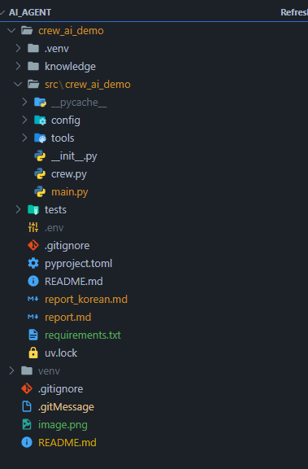
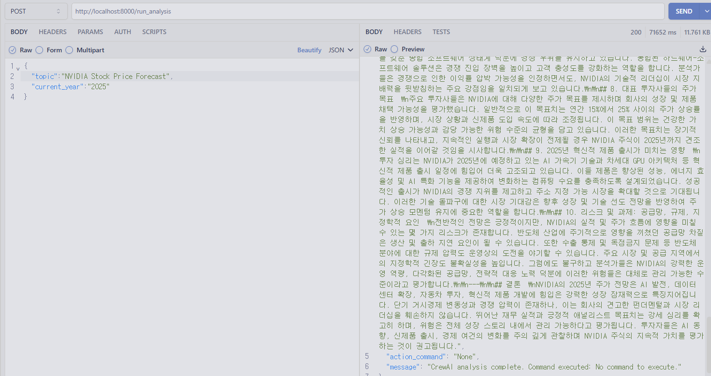

# AI_Agent

# Work
## ✅ 2025-07-08

- [X] 1. CREWAI 설치 및 실행
- [X] 2. AGENT 추가 : 보고서 한글 번역 AGENT 추가 
- [X] 3. FAST API 추가 : 동적으로 CREWAI 를 호출하기 위해 Fast API 적용 ( 리팩토링 필요 )
- [X] 4. CREWAI 를 활용한 프로젝트 아이디어 추가 

**1. CREWAI 설치 및 실행**


**2. AGENT 추가**

**agents.yaml**
```yaml
translator:
  role: >
    Korean Translator
  goal: >
    Translate all results and reports from previous agents into Korean.
  backstory: >
    You are a translation expert with an excellent ability to accurately and
    naturally convert given English text into Korean. You are known for
    perfectly capturing all technical terms and nuances in your translations.
```

**tasks.yaml**
```yaml
translation_task:
  description: >
    Translate the entire report provided into natural and accurate Korean.
    Ensure all sections, headings, and details are translated while maintaining
    the original meaning and nuance, especially for technical terms.
    The translated report should be ready for presentation.
  expected_output: >
    A fully translated report in Korean, formatted as markdown.
  agent: translator 
```

**crew.py**
```python
    @agent
    def translator(self) -> Agent:
        return Agent(
            config=self.agents_config['translator'], # type: ignore[index]
            verbose=True
        )

...
    @task
    def translation_task(self) -> Task:
        return Task(
            config=self.tasks_config['translation_task'], # type: ignore[index]
            output_file='report_korean.md', # 번역된 파일 저장 경로
            context=[self.reporting_task()] # reporting_task의 결과를 translation_task의 컨텍스트로 전달
        )

...
    @crew
    def crew(self) -> Crew:
        """Creates the CrewAiDemo crew"""
        # To learn how to add knowledge sources to your crew, check out the documentation:
        # https://docs.crewai.com/concepts/knowledge#what-is-knowledge

        return Crew(
            agents=self.agents, # Automatically created by the @agent decorator
            tasks=[
                self.research_task(),
                self.reporting_task(),
                self.translation_task() # <-- translation_task를 태스크 파이프라인에 추가
            ],
            process=Process.sequential,
            verbose=True,
            # process=Process.hierarchical, # In case you wanna use that instead https://docs.crewai.com/how-to/Hierarchical/
        )


```

**3. FAST API 추가**


**4. CREWAI 를 활용한 프로젝트 아이디어 추가**
```
Account의 고객명 ( 기업 이름 )을 사용합니다.
1. 제무제표 분석 결과 ( 저번 분기 대비, 전년 동일 분기 대비 ) 
2. 최신 뉴스 요약 및 뉴스 URL 
3. 동종 업계 비교  

해당 정보들을 가공하여 제공합니다.
```


***

## SETTING 

**가상화 설정**   
> ```
> py -3.10 -m venv venv // -3.10 은 설치된 파이썬 버전, 두번째 venv : 가상머신 이름
> ```


**가상화 실행 ( 가상 머신이 적용된 디렉토리에서 )**
>```
>.\venv\Scripts\activate 혹은 .\venv\Scripts\Activate.ps1
>```


### CREW AI OPERATE
>```
>crewai install
>crewai run
>```


### APP OPERATE
```commandline
uvicorn src.crew_ai_demo.main:app --reload --host 0.0.0.0 --port 8000
```
